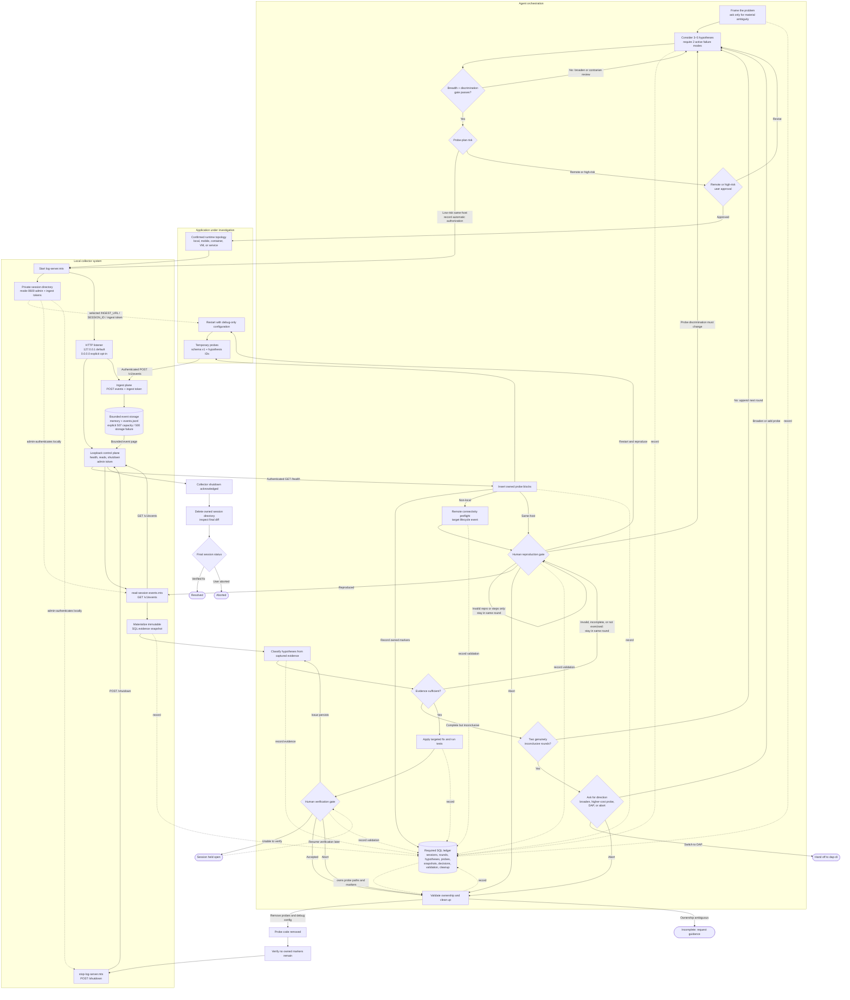

# debug

Evidence-driven debugging that tests competing hypotheses with temporary probes and local structured runtime logs.

> **Experimental:** This plugin requires human reproduction and acceptance gates. It never decides by itself that a bug is fixed.

## Skills

| Skill | Description |
|---|---|
| [debug](skills/debug/) | Orchestrates describe → hypothesize → instrument → reproduce → analyze → fix → verify and clean up |

## Optional Debug Agent

The user-invokable [Debug](agents/debug.agent.md) agent is intentionally a tiny entry point that delegates the complete workflow to the skill. The skill owns its durable SQLite investigation ledger, resume behavior, human gates, collector lifecycle, safe parallel advisory patterns, and cleanup rules, and remains independently usable.

## Workflow

1. **Describe** — capture the symptom, expected and actual behavior, reproduction steps, affected subsystem, and timing characteristics.
2. **Hypothesize** — consider 3–5 plausible theories and carry at least two distinct, falsifiable failure modes into instrumentation. No fix is made yet.
3. **Instrument** — start the authenticated collector (loopback by default, explicit trusted-network remote ingestion when needed) and add the smallest temporary probes needed to distinguish the hypotheses.
4. **Human reproduction gate** — stop autonomous work while the user restarts the affected process and reproduces the issue.
5. **Analyze** — classify every hypothesis from the captured event sequence as supported, weakened, falsified, inconclusive, or not exercised.
6. **Targeted fix** — apply the smallest evidence-backed correction and run focused automated tests.
7. **Human verification and cleanup** — wait for the user to verify the fix, then remove owned probes, verify no marker remains, stop the collector, remove temporary artifacts, and inspect the final diff.



The breadth and discrimination gate runs internally: each round requires at least two active hypotheses with distinct failure modes, explicit expected and disproof signals, and probe coverage. Shared probes are preferred, and event volume and observer effects are estimated before reproduction. The developer sees only a compact hypothesis summary, not a compliance checklist.

A new round begins only after a valid, complete reproduction leaves the theories inconclusive and the next plan materially improves theory breadth or discrimination. Collection failures, invalid reproductions, capacity rejection, and paths that were not exercised stay in the same round. After two genuinely inconclusive rounds, the workflow asks whether to broaden, add a higher-cost probe, switch to DAP-based debugging, or abort. Only material or newly high-risk probe changes require another approval. Verification failure returns to analysis or fixing unless probe changes materially expand scope. A session is incomplete until cleanup succeeds.

Read-only work can fan out across disjoint subsystem exploration, independent hypothesis generation, hypothesis-specific analysis of a materialized SQL event snapshot, and complementary-model rubber-duck critiques of probe plans or proposed fixes. One orchestrator retains all SQL writes, source edits, probe ownership, synthesis decisions, human gates, and cleanup.

When the initial request is concrete, the skill records its problem framing and proceeds without asking the user to confirm a restatement. It asks only for missing details that materially change the investigation. Low-risk same-host probes are automatically authorized and recorded; remote exposure and high-risk probes still require approval. Structured questions remain mandatory for reproduction, final verification, retry escalation after two inconclusive rounds, abort choices, and ambiguous cleanup. Plan-mode approval authorizes instrumentation but does not replace reproduction or verification.

## `debug` versus `dap-cli`

| Plugin | Responsibility |
|---|---|
| [`dap-cli`](https://github.com/roblourens/dap-cli) | DAP breakpoints, stepping, stacks, variable inspection, and debugger launch configuration |
| `debug` | Language-agnostic hypothesis testing through temporary instrumentation and structured runtime evidence |

`debug` does not implement or wrap the Debug Adapter Protocol.

## Prerequisites

- An agent host that can start and retain a long-running background terminal process.
- Node.js with native type stripping for `.mts` files.
- SQL tooling for the required investigation ledger.
- Resumable user turns for material clarifications, risk approvals, reproduction, verification, and cleanup guidance.
- IPv4 connectivity from each instrumented process to a collector ingest URL.
- Permission to add and later remove temporary probes in the affected source.

Invoke scripts by absolute plugin path so they work regardless of the application repository's current directory:

```sh
node <absolute-plugin-path>/scripts/log-server.mts
node <absolute-plugin-path>/scripts/log-server.mts --allow-remote
node <absolute-plugin-path>/scripts/log-server.mts --allow-remote \
  --advertise-host host.docker.internal
node <absolute-plugin-path>/scripts/debug-server-status.mts --config <absolute-config-path>
node <absolute-plugin-path>/scripts/read-session-events.mts --config <absolute-config-path>
node <absolute-plugin-path>/scripts/stop-log-server.mts --config <absolute-config-path>
```

Startup options:

| Option | Purpose |
|---|---|
| `--allow-remote` | Explicitly bind all IPv4 interfaces for trusted-network event ingestion |
| `--advertise-host <host>` | Advertise a target-reachable hostname or IPv4 address; requires `--allow-remote` |
| `--port <0-65535>` | Select a port; `0` asks the OS to assign one |
| `--session-directory <path>` | Use an explicit new session directory, enabling deterministic status/recovery paths |

## Collector and API

The startup script creates a private session directory under the OS temporary directory and binds an OS-assigned port. It uses `127.0.0.1` by default. Explicit `--allow-remote` binds `0.0.0.0` and advertises discovered private IPv4 candidates; `--advertise-host` supplies a target-reachable hostname or address for container aliases, VMs, forwarding, or unusual networks. `0.0.0.0` is never an ingest URL.

On POSIX systems, the mode-`0600` configuration stores two generated per-session tokens in a mode-`0700` directory. Windows relies on the current user's filesystem access controls. The ingest token authorizes only `POST /v1/events`; the admin token is accepted only from loopback for health, event reads, and shutdown. Neither token is printed. Local lifecycle scripts always use the loopback control URL.

Authenticated endpoints:

| Endpoint | Access | Purpose |
|---|---|---|
| `GET /health` | Loopback admin | Readiness, schema, session, and event count |
| `POST /v1/events` | Ingest token | Validate and append one structured event |
| `GET /v1/events?offset=0&limit=100` | Loopback admin | Read bounded, ordered event pages |
| `POST /shutdown` | Loopback admin | Acknowledge and perform graceful shutdown |

Accepted events use schema version 1 and kinds `probe`, `branch`, `error`, `lifecycle`, or `note`. The collector assigns a monotonically increasing sequence and server-received timestamp; client timestamps are retained but are not used for ordering.

## Local Data, Retention, and Privacy

- Logs remain on the collector host. There is no telemetry or upload to an external service.
- The server binds to IPv4 loopback by default. Remote ingestion requires explicit opt-in and is limited to trusted development networks because HTTP does not protect the ingest token in transit.
- Remote clients can only submit events with the ingest token. Administrative endpoints and the admin token remain loopback-only.
- Request bodies are limited to 64 KiB, normalized events to 16 KiB, individual data strings to 4 KiB, in-memory events to 10,000, event reads to 500, and the JSONL file to 10 MiB.
- Capacity and persistence failures are explicit: new events receive HTTP `507` at capacity or HTTP `500` after a storage failure; health/event reads report cumulative rejected and storage-failure counts. `read-session-events.mts` emits `DEBUG_EVENT_CAPACITY_REACHED` or `DEBUG_EVENT_STORAGE_FAILED`, and either result makes that collector's evidence incomplete.
- Data strings are bounded, but generic secret detection and redaction are **not** solved.

Never probe passwords, authorization headers, cookies, tokens, private keys, full environment maps, full request or response bodies, or arbitrary user-generated text. Prefer derived values such as `hasAuthHeader`, `bodyLength`, counts, enums, and branch decisions.

## Cleanup Guarantee

Every inserted block has a session-specific marker, and every touched file, marker, and newly created-file flag is recorded in the current investigation's `debug_probes` rows. SQLite is the sole cleanup authority. Cleanup validates those rows and marker boundaries before editing, removes only recorded blocks, searches for the exact session prefix afterward, and inspects the final diff. If a marker is missing or a block has drifted, the agent stops and asks rather than deleting ambiguous code. The collector is stopped through its authenticated endpoint. When that endpoint is unreachable, `debug-server-status.mts` reports the recorded PID as unverified process information and requires manual identity inspection before the user decides what to do; it never emits a kill command or discovers a process from a port collision.

The ledger uses the host's persistent session SQL database, never a file in the application repository. `skills/debug/schema.sql` is the canonical schema. At every resumed turn, the skill adopts the matching open investigation before creating a new one.

## Mobile, Containers, and Services

- **Physical iOS or Android:** advertise the development host's private IPv4 address while both devices are on the same trusted network. Keep credentials and any iOS local-network permission or narrowly scoped App Transport Security exception in debug-only configuration.
- **Docker Desktop:** use `--advertise-host host.docker.internal`.
- **Linux containers:** configure a host-gateway alias or advertise the reachable bridge/gateway address.
- **VMs and other development hosts:** use a reachable private address or an existing reviewed secure port forward. A forward terminating on loopback does not require remote binding.
- **Microservices:** retain loopback when services share the collector host; opt into remote ingestion only across network namespaces or hosts.

Automatic discovery produces candidates, not proof of target reachability. Before reproduction, the target must submit a `debug-connectivity-check` lifecycle event and the local read script must observe it. The workflow records the topology and preflight result in SQL without storing tokens.

## Known Limitations

- Remote mode is IPv4-only and provides no TLS, tunnel management, mDNS, or automatic port forwarding.
- Remote HTTP ingestion is appropriate only on a trusted development network.
- Browser CORS and HTTPS mixed-content policy can prevent direct event posts.
- Browser bundles must never contain the ingest token; use backend instrumentation or a reviewed local relay.
- Short-lived processes may exit before fire-and-forget requests flush.
- Probes can affect timing and may mask race conditions.
- Collector arrival order is not distributed causal order.
- Secret redaction is not automatic.
- Only inline JavaScript/TypeScript and Python examples are documented for V1.
- There is no automatic proactive mode switch.
- Human reproduction and final acceptance are mandatory.
- Server or cleanup failure leaves the session incomplete.

## Plugin Structure

```text
debug/
├── .plugin/
│   └── plugin.json
├── CHANGELOG.md
├── README.md
├── agents/
│   └── debug.agent.md
├── scripts/
│   ├── debug-server-status.mts
│   ├── log-server.mts
│   ├── log-server-impl.mts
│   ├── read-session-events.mts
│   ├── stop-log-server.mts
│   └── log-server.test.mts
└── skills/
    └── debug/
        ├── SKILL.md
        └── schema.sql
```
